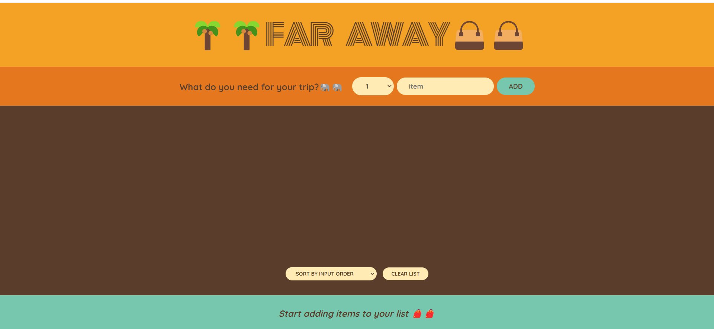
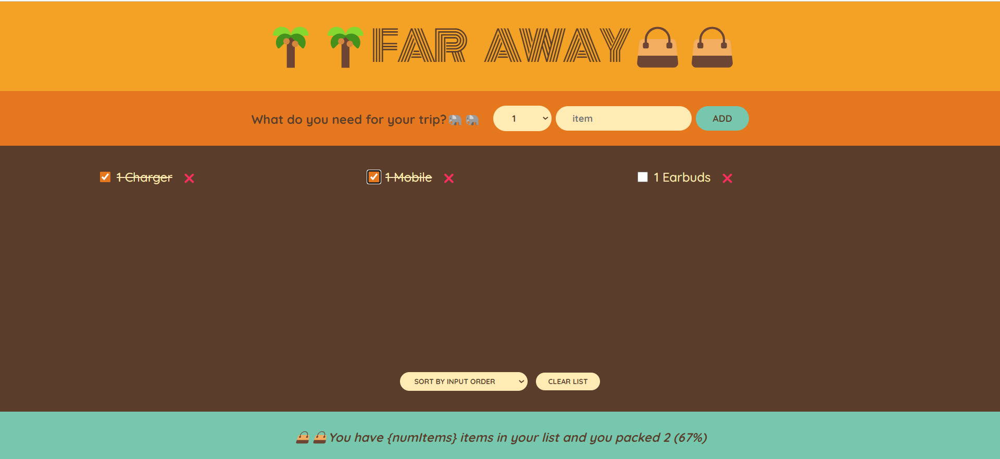

````markdown
# React Packing List App 🌴👜

This is a simple React application that allows you to create and manage a packing list for your trip. It provides features for adding items, marking them as packed, sorting the list, and displaying packing statistics.




## Features

- **Add Items:** Easily add items you need to pack for your trip.
- **Mark Items as Packed:** Check off items as you pack them.
- **Sort the List:** Sort items by input order, item description, or packed status.
- **Clear the List:** Remove all items from the list.
- **Statistics:** Get statistics on your packing progress.

## Getting Started

Follow these steps to run the app locally:

1. **Clone the repository:**

   ```bash
   git clone https://github.com/PrateekSavanur/Travel-List.git
   cd Travel-List
   ```
````

2. **Install Dependencies:**

   ```bash
   npm install
   ```

3. **Run the Development Server:**

   ```bash
   npm start
   ```

   This will start the development server, and you can access the app at `http://localhost:3000`.

4. **Start Packing!** Add items to your packing list and start packing for your trip.

## Usage

- To add a new item, enter its description and quantity, and click the "Add" button.
- To mark an item as packed, check the checkbox next to it.
- To delete an item, click the "❌" button.
- Use the sorting options to organize your list based on your preferences.
- Click the "Clear list" button to remove all items from your list.

## Contributing

Contributions to this project are welcome. If you'd like to improve the app, fix a bug, or add new features, please follow the standard GitHub fork and pull request workflow.
